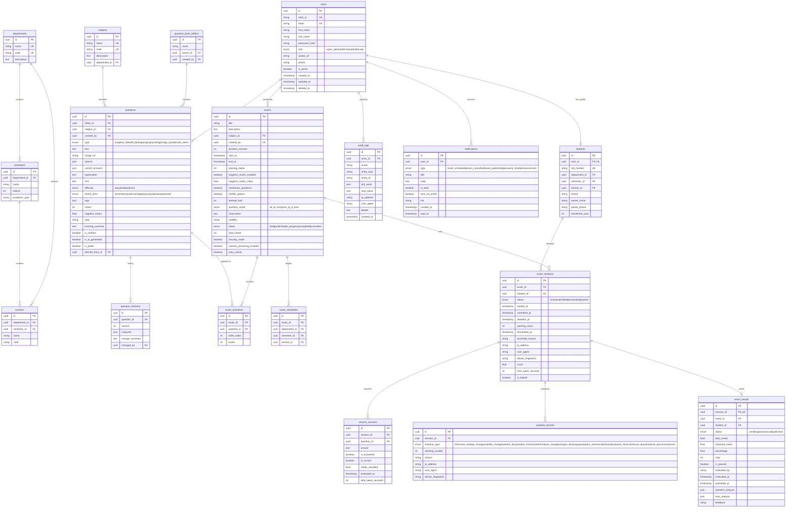

# ExamShield ER Diagram

## Conventions

- All primary keys: UUID v4, generated client-side.
- `created_at` / `updated_at` on all entities (server defaults).
- Soft deletes via nullable `deleted_at` (indexed) on user-facing entities.
- Audit logs: append-only, never mutated.
- Indexed foreign keys + composite indexes on hot paths:
  - `(student_id, exam_id, status)` — active session lookup
  - `(subject_id, difficulty)` — question paper selection
  - `(type, bloom_level)` — question bank filters
- Enum values stored as native Postgres enums (migration-managed).
